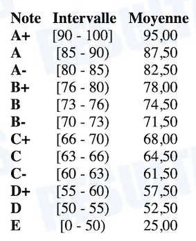

# INF5153 - Génie logiciel: Conception

## Informations Générales

  * Équipe Enseignante :
    * Professeur : Sébastien Mosser ([Site web personnel](https://mosser.github.io), [Groupe de recherche ACE](https://ace-design.github.io))
    * Démonstrateur : Carlos Cortez-Linares
    * Correctrice : Imen Benzarti
  * Horaire du groupe `040`, session d'automne 2019:
    * Cours : Jeudi, 09h30 - 12h30, PK-R610
    * Atelier : Mardi, 09h30 - 11h30, PK-S1565 (anciennement PK-S1550)
  * Communication :
    * Disponibilité sans rendez-vous : Jeudi, 08h00 - 09h30, local PK-4820
    * Slack : [https://inf5153-a19.slack.com](https://inf5153-a19.slack.com) (sur invitation)

### Objectif du cours

Les cours vont reprendre des principes de base de la programmation orientée objet, [mais du point de vue du génie logiciel et non plus de l'informatique pure](./docs/got.jpg). Pour certains cours (typiquement les études de cas), il vous sera demandé de le préparer à l'avance par la lecture d'un document qui sera mis à disposition sur le Slack.

### Évaluation & Planning de rendus

**Les dates de remise s'entendent sur le fuseau horaire de Montréal, à 23:50 le jour de la date de remise. Tout rendu hors délai recevra la note de zéro (0). Les règles concernant le plagiat seront appliquées sans aucune tolérance.**

| Date(s)        | Travail à rendre               | Objectif                                             | Poids |
| :---:          | :---                           | :---                                                 | :---: |
|  05.09 ➝ 24.09 | Projet 1                       | Conception guidée (individuel)                       | 10%   |
|  17.10         | :notebook: **Examen intra**    | Principes fondamentaux                               | 20%   |
|  25.09 ➝ 20.10 | Projet 2 - PMV                 | Concevoir et développer un produit minimal & viable  | 10%   |
|  21.10 ➝ 15.12 | Projet 2 - Final               | Corriger une conception, intégrer des évolutions     | 20%   |
|  12.12         | :notebook: **(Examen final)**  | Principes fondamentaux & avancés                     | 40%   |

Pour les Travaux Pratiques, le rendu se fait à travers la plateforme GitHub Classroom. Les TPs sont a réaliser par équipe. Les dépôts de code seront clonés automatiquement par un script, et tout travail non rendu via ce biais ou hors délais ne sera pas évalué.  La couverture _fonctionelle_ de vos TPs est automatiquement vérifiée par la bonne exécution de scénarios _Cucumber_.

L'examen _intra_ portera sur les séances des semaines le précédant. L'examen _final_ portera sur la totalité du cours. Pour les examens, vous avez le droit à une feuille de notes manuscrites (format _Letter_, recto-verso, écrite à la main et non photocopiée), et à la _cheatsheet_ UML donnée sur cette page.

Les semaines 43 et 49 correspondent à des présentations orale de chacune des équipe-projets. Ces présentations sont à huis clos. Quand les équipes ne sont pas en train de présenter, le local de cours est disponible pour travailler en équipe sur le projet.

Le planning de correction est prévu pour vous permettre d'avoir une évalutation des RESULTATS du projet 1, de l'intra et de la première livraison du projet 2 (soit 40% de l'évaluation) en semaine 44. La date limite d'_abandon de cours sans mention d'échec avec facturation_ (`XX`) est le mercredi 6 novembre (semaine 45) dans le calendrier du registrariat pour la session d'automne.

## Agenda des séances

En régime régulier, les cours ont lieu le jeudi et les ateliers le mardi. En cas d'inversions ponctuelles, les changements seront annoncé sur le slack le plus tôt possible et au moins sept (7) jours à l'avance. 

| #Semaine | Atelier (Mardi, 2h) | Cours (Jeudi, 3h) | 
| :---: | :---:   | :---    | 
| #36   |  | [Pourquoi concevoir ? De _Programmeur_ à _Développeur_.](./cours/01_Programmeur_Developpeur.pdf) |
| #37   |  Poker  | [Encapsulation, Types et Interfaces](./cours/02_Encapsulation_Type_Etat.pdf)  |
| #38   |  Poker  | [Composition _versus_ Héritage, Tests](./cours/03_Composition_Heritage_Tests.pdf)   |
| #39   |  Poker  | [Principes de conception (GRASP, SOLID)](./cours/04_SOLID_GRASP.pdf)  |
| #40   |  Island (MVP) | [Étude de cas _Jeu de Dés_](./cours/05_JeuDeD%C3%A9s.pdf)  |
| #41   |  Island (MVP) | [Intro aux Patrons de conception (padawan)](./cours/06_design_patterns.pdf)  |
| #42   |  Island (MVP) | [**Examen intra**](./exams/intra_A19.pdf) (Campus central, locaux A-2405, A-2625, A-2710)|
| #43   | _Présentations_ | _Présentations_ |
| #44   |  Island (Complet) | Étude de cas intra & Rétro-action projets |
| #45   |  Island (Complet) | [Patrons de conception (chevalier)](./cours/09_patterns_chevaliers.pdf)  |
| #46   |  Island (Complet) | [Patrons de conception (maître)](./cours/10_patterns_master.pdf)  |
| #47   |  Island (Complet) | Live-coding: _UQAM Unit Test Framework_ |
| #48   |  Island (Complet) | Mesure et visualisation du logiciel (_Code as a crime scene_) |
| #49   |  _Présentations_ |  _Présentations_  |
| #50   |  _Révisions_  |  **Examen Final** (Campus des Sciences, locaux à venir) |

Materiel supplémentaire :

  * _Cheatsheet_ sur la syntaxe UML : [cheatsheet.pdf](./docs/cheatsheet.pdf)
      * autorisée au examens en plus d'une feuille de note manuscrites

  * Dépôts de code : 
      * [Référence pour les patrons de conception](https://github.com/ace-lectures/pattern-repository)
      * [Étude de cas "_UQAM Unit Test Framework_"](https://github.com/ace-lectures/inf5153-junit-demo) 

  * Examens des sessions précédentes (exemples non contractuels)
    * (UQAM) 2019-H: [Intra](./docs/exams/19_H_1_intra.pdf), [Final](./docs/exams/19_H_2_final.pdf)
    * (Polytech Nice) 2018-A: [Final](./docs/exams/18_A_FR_final.pdf)
    * (Polytech Nice) 2017-A: [Final](./docs/exams/17_A_FR_final.pdf)
 
## Travaux

Les ateliers ne sont pas optionnels, et font partie intégrante de l'enseignement de ce cours. Si vous avez un conflit d'horaire avec un autre cours et une dérogation de la direction de votre programme d'étude associée, informez immédiatement l'équipe enseignante sur Slack.

### Projets de session (à rendre)

Vous êtes fortement encouragés à utiliser Slack pour poser des questions durant les projets. 

  * Projet 1 : [le Jeu de Poker](./projets/TP1.md) (individuel)
  * Projet 2 : Explorations d'îles inconnues (en équipe de 3 ou 4 étudiants)
    * Version intermédiaire : _Produit Minimal & Viable_
    * Version finale : _Produit Complet_  
    * Documents : [Description du sujet](./projets/TP2/README.md), [Protocole d'utilisation du drone](./projets/TP2/Drone.md)
        * Fichier de carte pour démarrer [`_map.json`](https://gist.githubusercontent.com/mosser/fedfb0b5b97ef88832e9d431835ccc4f/raw/31c1b4b47641bc049149530bdf465c68cdebdfb4/_map.json)

## Barème

Le cours utilise la grille d'évaluation standard de l'UQAM définie dans RESULTATS. La note de passage est de 50%, et il n'y a pas de double seuil TP/examens.

## Bibliographie

### Livres d'enseignement

  * _Introduction to Software Design with Java_. Springer, 2019.
    * Martin Robillard (_McGill University_). 
    * [Accès PDF SpringerLink via UQAM](https://link.springer.com/book/10.1007%2F978-3-030-24094-3)
  * _UML@Classroom_, Springer Verlag, 2015.
    * Martina Seidl, Marion Scholz, Christian Huemer & Gerti Kappel (_Université de Technologie de Vienne_).
    * [Accès PDF SpringerLink via UQAM](https://link.springer.com/book/10.1007%2F978-3-319-12742-2)
    * [Site web ressource (diapos additionelles)](http://www.uml.ac.at/en/)

### Livres professionels

  * _Software Systems Architecture: Working With Stakeholders Using Viewpoints and Perspectives_, Addison Wesley, 2011.
    * Nick Rozanski & Eoin (_pronounced “Owen”_) Woods.
    * Disponible en bibliothèque (BU Sciences, cote `QA 76.76 D47 R69 .2012`)
  * _Head First Design Patterns, a brain friendly guide_. O'REILLY. 
    * Eric Freeman, Elisabeth Robson. 
    * _(Existe en version française: "Design patterns tête la première")_
  * _Clean Code_. 
    * Robert Martin. Prentice Hall. 
    * Disponible en bibliothèque (BU Sciences, cote `QA 76.76 D47 M38 .2009`)
    * _(Existe en version française: "Coder proprement")_
  * _Pragmatic Unit Testing_. The pragmatic programmers. 
    * Jeff Langr, with Andy Hunt and Dave Thomas.  
    * Disponible en bibliothèque (BU Sciences, cote `QA 76.73 J38 L36 .2015`)
  * _Implementing Domain-Driven Design_, Addison-Wesley Professional, 2013.
    * Vaughn Vernon
  * _Design Patterns: Elements of Reusable Object-Oriented Software_, Addison Wesley, 1994.
    * Erich Gamma, Richard Helm, Ralph Johnson & John Vlissides.
    * Disponible en bibliothèque (BU Sciences, cote `QA76.64D49`)
    * _(Existe en version française: "Design patterns catalogue de modèles de conception réutilisables")_ 
  * _Refactoring: Improving the Design of Existing Code_, Addison Wesley, 2018 (2nd edition)
    * Martin Fowler.  
    * Disponible en bibliothèque (BU Sciences, cote `QA 76.76 R42 F69 .1999`)

## Règlement 18 sur les Infractions de nature académique

Tout acte de plagiat, fraude, copiage, tricherie ou falsification de document commis par un.e étudiant.e, de même que toute participation à ces actes ou tentative de  les commettre, à l’occasion d’un examen ou d’un travail faisant l’objet d’une évaluation ou dans toute autre circonstance, constituent une infraction au sens de ce règlement. 

La liste non limitative des infractions est définie comme suit : 

  * la substitution de personnes ; 
  * l’utilisation totale ou partielle du texte d’autrui en le faisant passer pour sien ou sans indication de référence ;  
  * la transmission d’un travail aux fins d’évaluation alors qu’il constitue essentiellement un travail qui a déjà été transmis aux fins d’évaluation académique à l’Université ou dans une autre institution d’enseignement, sauf avec l’accord préalable de l’enseignante, l’enseignant ; 
  * l’obtention par vol, manœuvre ou corruption de questions ou de réponses d’examen ou de tout autre document ou matériel non autorisés, ou encore d’une évaluation non méritée ; 
  * la possession ou l’utilisation, avant ou pendant un examen, de tout document non autorisé ; 
  * l’utilisation pendant un examen de la copie d’examen d’une autre personne ; 
  * l’obtention de toute aide non autorisée, qu’elle soit collective ou individuelle ; 
  * la falsification d’un document, notamment d’un document transmis par l’Université ou d’un document de l’Université transmis ou non à une tierce personne, quelles que soient les circonstances ; 
  * la falsification de données de recherche dans un travail, notamment une thèse,  un mémoire, un mémoire-création, un rapport de stage ou un rapport de recherche. 

Les sanctions reliées à ces infractions sont précisées à l’[article 3 du Règlement no 18](https://instances.uqam.ca/wp-content/uploads/sites/47/2017/12/REGLEMENT_NO_18.pdf) sur les infractions de nature académique.

Vous pouvez consulter sur le site [r18.uqam.ca](http://r18.uqam.ca) des capsules vidéos qui vous en apprendront davantage sur l’intégrité académique et le R18, tout en vous  orientant vers les ressources mises à votre disposition par l’UQAM pour vous aider à éliminer le plagiat de vos travaux.
